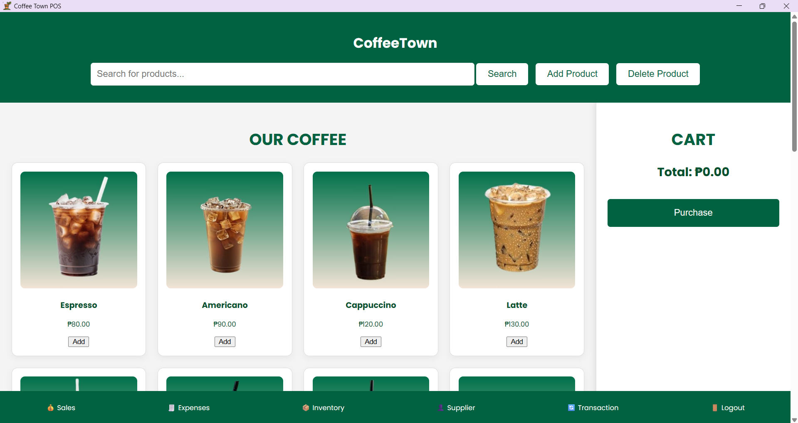
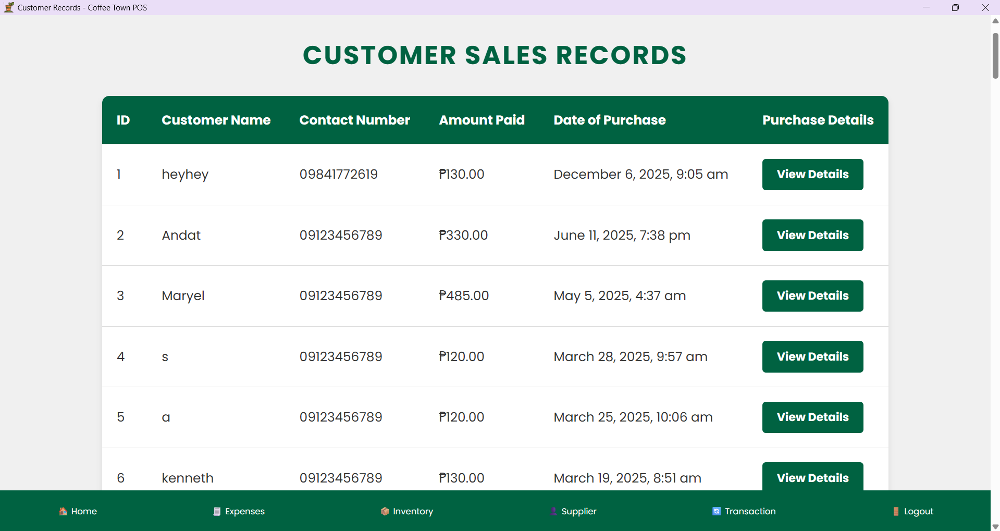
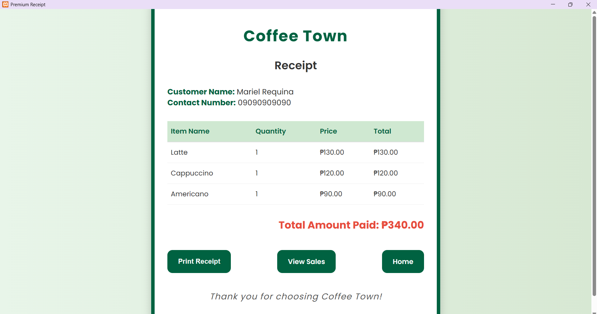
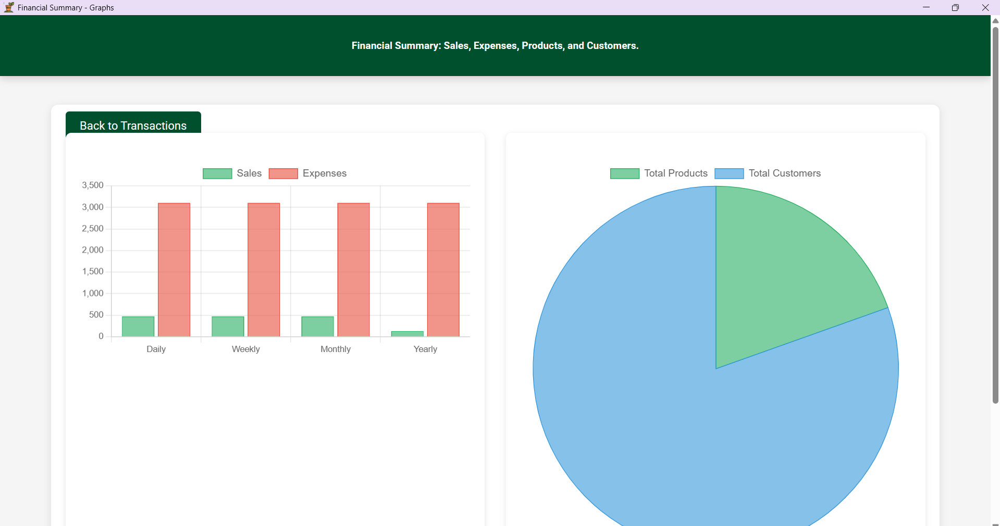

# CoffeeTown - Coffee Shop Management System

## 📋 Project Description

CoffeeTown is a comprehensive web-based coffee shop management system designed to streamline daily operations for coffee shops and cafés. Built with PHP and MySQL, this system provides an intuitive interface for managing inventory, processing orders, tracking sales, and generating detailed reports.

**Key Objectives:**
- Simplify product and inventory management
- Accelerate order processing and payment handling
- Provide real-time sales analytics and reporting
- Enhance customer service through efficient order tracking
- Maintain accurate records of transactions and stock movements

**Target Users:**
- Coffee shop owners and managers
- Baristas and front-line staff
- Inventory managers

---

## ✨ List of Features

### 1. Product Management (CRUD Operations)

#### **Create**
- Add new products with comprehensive details:
  - Product name and description
  - Category assignment (Coffee, Pastries, Beverages, etc.)
  - Pricing information
  - Product images (upload and display)
  - Initial stock quantity
  - SKU/barcode information
- Quick product entry with form validation
- Image upload functionality with preview

#### **Read**
- View all products in a paginated list
- Search products by name, category, or SKU
- Filter products by:
  - Category
  - Price range
  - Stock status (In Stock, Low Stock, Out of Stock)
- Sort products by name, price, or stock quantity
- Product detail view with complete information
- Visual indicators for low stock items
- Display product images in list and detail views

#### **Update**
- Edit existing product information:
  - Modify name, description, and category
  - Update pricing
  - Change product images
  - Adjust stock quantities
  - Update SKU/barcode
- Real-time form validation
- Immediate updates reflected in inventory
- Stock adjustment tracking

#### **Delete**
- Remove products from the system
- Confirmation prompt before deletion
- Prevent deletion of products with:
  - Active orders
  - Recent transaction history
- Clean removal of associated product data
- Option to deactivate instead of permanent deletion

### 2. Order Processing
- **Point of Sale (POS) Interface**: User-friendly order entry screen
- **Multi-item Orders**: Add multiple products to a single order
- **Real-time Pricing**: Automatic calculation of totals and taxes
- **Payment Methods**: Support for Cash and Card payments
- **Order Summary**: View order details before confirmation
- **Receipt Generation**: Generate digital receipts for customers
- **Order History**: Track and view past orders
- **Stock Updates**: Automatic inventory deduction upon order completion

### 3. Inventory Management
- **Real-time Stock Tracking**: Automatic updates when orders are processed
- **Low Stock Alerts**: Visual indicators for products running low
- **Stock Adjustments**: Manual stock increase or decrease with reasons
- **Inventory Reports**: Current stock levels and valuations
- **Stock Movement History**: Track all inventory changes
- **Supplier Management**: Record supplier information for restocking

### 4. User Authentication
- **User Registration**: Create new user accounts with secure signup
- **Login System**: Secure authentication with password hashing
- **Session Management**: Maintain user sessions securely
- **Logout Functionality**: Safe session termination
- **Password Security**: Encrypted password storage

### 5. Sales & Reporting
- **Sales Dashboard**: Overview of recent sales and transactions
- **Sales Reports**: Daily, weekly, and monthly sales summaries
- **Financial Summary**: Revenue tracking and payment breakdowns
- **Product Analytics**: Best-selling products and inventory insights
- **Transaction History**: Complete record of all transactions
- **Graphical Reports**: Visual charts for sales trends
- **Export Options**: Generate reports for record-keeping

### 6. Payment Processing
- **Multiple Payment Methods**: Cash and card payment options
- **Payment Recording**: Track all payment transactions
- **Receipt Generation**: Automatic receipt creation for each payment
- **Payment History**: View all past transactions
- **Transaction Details**: Complete payment information storage

### 7. Expense Management
- **Record Expenses**: Track business expenses and costs
- **Expense Categories**: Organize expenses by type
- **Expense Reports**: Monitor spending patterns
- **Date-based Tracking**: Record expenses with timestamps

### 8. Supplier Management
- **Add Suppliers**: Store supplier contact information
- **Supplier Database**: Maintain list of all suppliers
- **Payment to Suppliers**: Record payments made to suppliers
- **Supplier History**: Track transactions with each supplier

---

## 🛠️ Setup Instructions

### Prerequisites

- **PHP**: Version 7.4 or higher
- **MySQL**: Version 5.7 or higher
- **Web Server**: Apache (XAMPP/WAMP recommended for local development)
- **Web Browser**: Modern browser (Chrome, Firefox, Edge)

### Installation Steps

#### 1. Clone or Download the Repository
```bash
git clone https://github.com/yourusername/coffeetown.git
cd coffeetown
```

Or download and extract the ZIP file to your web server directory.

#### 2. Configure Database Connection
Open `config/db.php` and update with your database credentials:

```php
<?php
$host = 'localhost';
$dbname = 'coffeetown';
$username = 'root';  // Your MySQL username
$password = '';      // Your MySQL password
?>
```

#### 3. Create Database
Open phpMyAdmin or MySQL command line:

```sql
CREATE DATABASE coffeetown;
```

#### 4. Import Database Schema
- Open phpMyAdmin
- Select the `coffeetown` database
- Click on "Import" tab
- Choose the file: `database/coffee_town.sql`
- Click "Go" to import

**Or use command line:**
```bash
mysql -u root -p coffeetown < database/coffee_town.sql
```

#### 5. Configure Web Server

**For XAMPP:**
1. Copy the `coffeetown` folder to `C:\xampp\htdocs\`
2. Start Apache and MySQL from XAMPP Control Panel
3. Access the application at: `http://localhost/coffeetown/public/`

**For WAMP:**
1. Copy the `coffeetown` folder to `C:\wamp64\www\`
2. Start WAMP services
3. Access the application at: `http://localhost/coffeetown/public/`

**For PHP Built-in Server:**
```bash
cd coffeetown/public
php -S localhost:8000
```
Access at: `http://localhost:8000/`

#### 6. Set Folder Permissions (Linux/Mac only)
```bash
chmod -R 775 public/uploads
chmod -R 775 public/images
```

#### 7. Access the Application
Open your browser and navigate to:
- **XAMPP/WAMP**: `http://localhost/coffeetown/public/`
- **Built-in Server**: `http://localhost:8000/`

#### 8. Create Your First User
1. Navigate to the signup page: `signup.php`
2. Register a new user account
3. Login with your credentials
4. Start managing your coffee shop!

---

## 📸 Screenshots

### Dashboard

*Main dashboard showing sales overview, recent orders, and key metrics with easy navigation*

### Sales Management

*Point of sale interface for processing customer orders with product selection and shopping cart*

### Order Processing & Receipt

*Digital receipt generation displaying order details, items purchased, and payment information*

### Reports

*Comprehensive reporting interface with sales analytics, financial summaries, and inventory insights*

---

## 🗄️ Database Schema

The application uses the following main tables:

- **`users`** - User accounts and authentication
- **`products`** - Product information, pricing, and stock
- **`categories`** - Product categories
- **`orders`** - Customer orders
- **`order_items`** - Individual items within orders
- **`inventory`** - Stock management and movements
- **`transactions`** - Payment records
- **`suppliers`** - Supplier information
- **`expenses`** - Business expense tracking
- **`payments`** - Payment processing records

---

**Made with ☕ by itsmarielrequina, and friends**